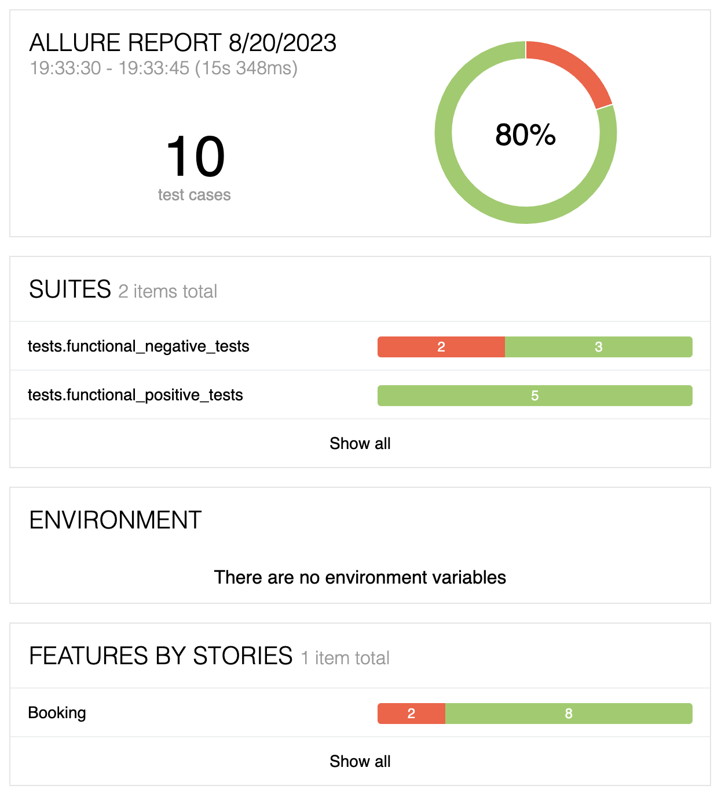
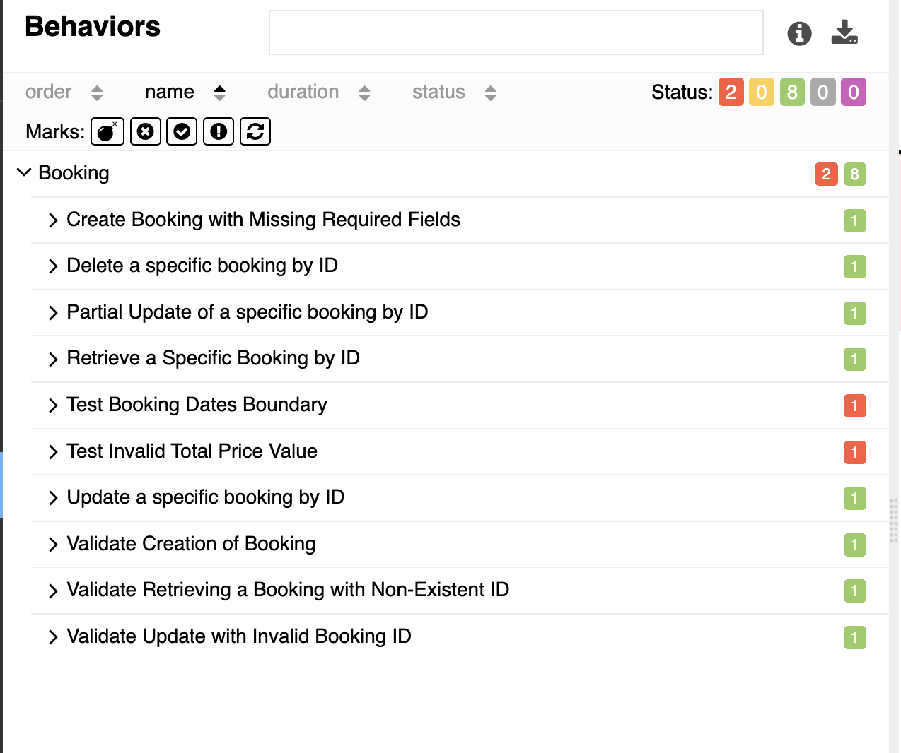
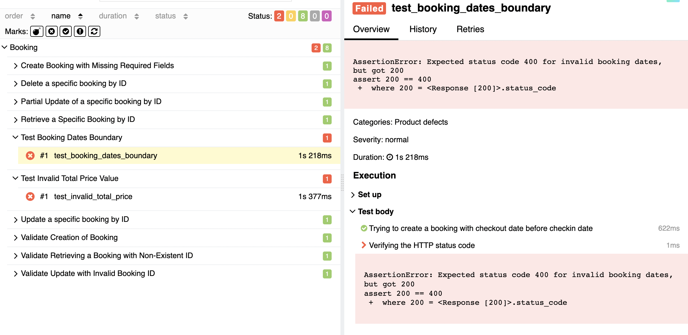
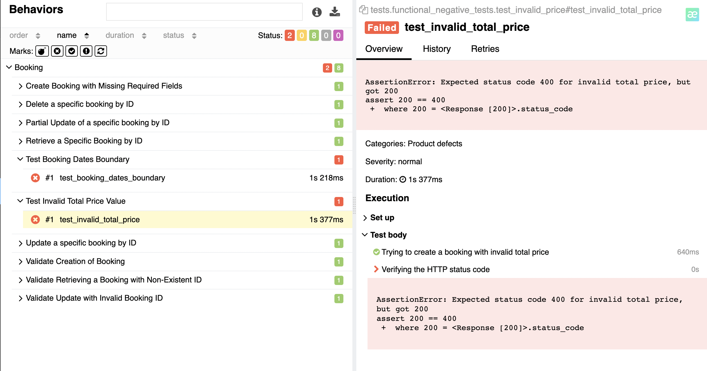

# API tests for [Restful-Booker](https://restful-booker.herokuapp.com/apidoc/index.html)

This repository contains a collection of tests designed for validating the functionality of a booking API. 

## Technology Stack

- **Python**: The programming language for writing tests.
- **Requests**: A Python library for making various HTTP requests.
- **Allure**: For detailed test reporting.
- **Pytest**: The primary testing framework used to structure the tests.
- **Voluptuous**: A Python data validation library employed to validate data structures.

<p align="center">
<a href="https://www.python.org/"></a>
<a href="https://pytest.org/"></a>
<a href="https://requests.readthedocs.io/en/latest/"></a>
<a href="https://github.com/allure-framework/allure2"></a>
</p>

## Test Suites and Test Cases

1. **Functional Positive Cases**
- Create a new booking
- Retrieve a specific booking by ID
- Update a specific booking by ID
- Partially update a specific booking
- Delete a booking

2. **Functional Negative Cases**
- Create booking with missing required fields
- Retrieve a booking with non-existent ID
- Update with invalid booking ID
- Test booking dates boundary
- Test invalid total price value

## Testing Techniques
- **Boundary Testing**: Checking the behavior at the boundary limits of input data.
- **Positive/Negative Testing**: Validating that the API functions correctly in both valid and invalid input scenarios.


## Test Execution Results



Out of the 10 test cases executed, 2 have failed. These failures are related to the negative tests, specifically:

- Test booking dates boundary
- Test invalid total price value



While the specific requirements regarding these behaviors were not provided, it's typically expected that an API would handle such cases with proper validation. 
For instance, having the checkout date before the check-in or accepting negative prices are both areas that ideally should raise errors.


## Bug Reports

### 1. Booking Dates Boundary

**Severity**: High

**Description**: When creating a booking with a checkout date set before the check-in date, the API accepts the request without error.

**Precondition**:    

1. Ensure you have access to the API endpoint.
2. Obtain an authentication token by sending a POST request to /auth endpoint with valid credentials.

**Steps to reproduce**:

1.Send a POST request to '/booking' endpoint using the following headers and  payload:


```
    headers = {
        "Content-Type": "application/json",
        "Accept": "application/json",
        "Cookie": f"token={token}"
    }

    payload = {
        "firstname": "Jim",
        "lastname": "Brown",
        "totalprice": 111,
        "depositpaid": True,
        "bookingdates": {
            "checkin": "2023-05-01",
            "checkout": "2023-04-30"
        }
    }

```

**Expected Result**: An error message indicating the checkout date cannot be before the check-in date.

**Actual Result**: The booking is created without any error message.   

**Attachments**




### 2. Invalid Total Price Value

**Severity**: Medium

**Description**: The API allows bookings with negative values for the total price.

**Precondition**:

1. Ensure you have access to the API endpoint.
2. Obtain an authentication token by sending a POST request to /auth endpoint with valid credentials.

**Steps to reproduce**:

1.Send a POST request to '/booking' endpoint using the following headers and  payload:

```
    headers = {
        "Content-Type": "application/json",
        "Accept": "application/json",
        "Cookie": f"token={token}"
    }

    payload = {
        "firstname": "Andy",
        "lastname": "Long",
        "totalprice": -111,
        "depositpaid": True,
        "bookingdates": {
            "checkin": "2023-05-01",
            "checkout": "2023-05-02"
        }
    }
```

**Expected Result**: An error message indicating that total price can't be negative.

**Actual Result**: The booking is created with a negative total price.

**Attachments**

